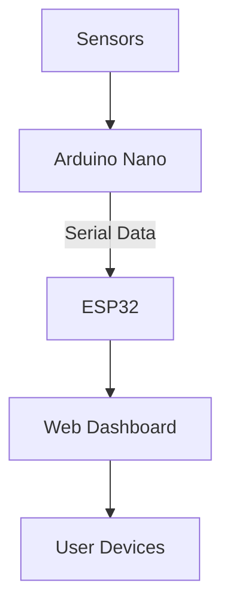

# 🌬️ AQMS - Air Quality Monitoring System

*Real-time environmental monitoring with style*

## 🚀 Overview
AQMS is an IoT-powered air quality monitoring system that tracks multiple environmental parameters in real-time. Built with ESP32 and Arduino, it provides a sleek web dashboard to visualize air quality data with historical trends.

## 🌟 Features

| Feature               | Description                                                                 |
|-----------------------|-----------------------------------------------------------------------------|
| 📊 Multi-parameter Monitoring | Tracks AQI, temperature, humidity, methane, and particulate matter         |
| ⏱️ Real-time RTC Integration | Precise timestamping with Arduino's real-time clock                         |
| 📱 Responsive Dashboard | Beautiful web interface accessible from any device                          |
| 📈 Historical Data Logging | Stores last 10 readings with timestamps                                    |
| 🚨 Air Quality Alerts | Color-coded status indicators (Good/Moderate/Unhealthy)                     |


**Components Used:**
- ESP32 (WiFi + Bluetooth)
- Arduino Nano (with RTC module)
- MQ135 (Air Quality Sensor)
- MQ4 (Methane Sensor)
- DHT11 (Temperature & Humidity)
- RTC (Real Time Clock)

## 📊 Data Flow Architecture



## 🖥️ Dashboard Preview (Version 2) ##


**Key UI Elements:**
- Live gauge-style metrics
- Historical data table (date/time separated)
- Color-coded AQI status badges
- Auto-refreshing every 5 seconds
- Mobile-responsive design

## 🔧 Installation

1. **Flash the Arduino:**
   ```bash
   arduino-cli compile --fqbn arduino:avr:nano AirQualitySensor.ino
   arduino-cli upload -p /dev/ttyUSB0 --fqbn arduino:avr:nano AirQualitySensor.ino
   ```

2. **Upload ESP32 Code:**
   ```bash
   platformio run --target upload --environment esp32dev
   ```

3. **Configure WiFi:**
   ```cpp
   // In ESP32 code:
   const char* ssid = "YOUR_SSID";
   const char* password = "YOUR_PASSWORD";
   ```


## 👥 Development Team

| Role                           | Team Member          | Contribution                          |
|--------------------------------|----------------------|---------------------------------------|
| Lead Developer                 | Sunandan Kar         | Sensor integration & PCB design       |
| Database & Network Management  | Sweta Poddar         | Data visualization & Analytics        |
| Software Architect             | Swarnavo Pramanik    | ESP32 firmware & Web Dashboard        |


## 🌱 Future Enhancements
- [ ] Add push notifications for poor air quality
- [ ] Implement machine learning for pollution prediction
- [ ] Develop mobile app companion
- [ ] Add OTA (Over-the-Air) updates
